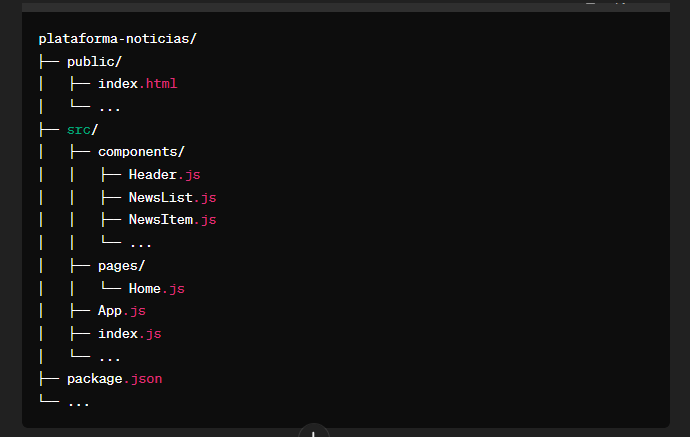

# Plataforma de Noticias

------------

## ESTE PROYECTO FUE ABANDONADO

Debido a no encontrar una api de noticias gratuitas, el proyecto fue abandonado. Muchas gracias si te intereso. Puedes ver mas en mi [repositorio](https://github.com/Mafifa?tab=repositories)

-----------

Plataforma donde los usuarios puedan ver las últimas noticias de diferentes fuentes y categorías. Se integra una API de noticias para obtener los datos y mostrarlos en la aplicación. Implemente funciones con (la posibilidad de guardar noticias favoritas[<strong>Esta es opcional</strong>]), buscar por palabra clave y filtrar por categoría.

## Paso 1: Comienza a trabajar y no te detengas

Tienes prohibido no terminar este proyecto.

## Paso 2: Estructura de Carpetas y Archivos

Dentro del directorio del proyecto, organiza la estructura de carpetas de la siguiente manera:

## Paso 3: Creación de Componentes

- Header.js: Componente para la barra de navegación y encabezado de la aplicación.
- NewsList.js: Componente para mostrar la lista de noticias.

- NewsItem.js: Componente para mostrar cada artículo de noticias individualmente.

## Paso 4: Configuración de Routing

Instala React Router para manejar la navegación entre páginas:

En el archivo App.js, configura las rutas de la aplicación utilizando React Router.

## Paso 5: Consumo de la API de Noticias

- Busca una API de noticias que proporcione datos de noticias. Por ejemplo, NewsAPI, New York Times API, etc.

- Regístrate en la API y obtén una clave de API para realizar solicitudes.

- Crea un archivo api.js para gestionar las solicitudes a la API de noticias utilizando fetch.

## Paso 6: Desarrollo de Componentes

- Implementa el componente Header.js para la barra de navegación.

- Desarrolla el componente NewsList.js para mostrar la lista de noticias obtenidas de la API.
- Crea el componente NewsItem.js para representar cada artículo de noticias individualmente.

## Paso 7: Integración con la API de Noticias

- En el componente Home.js, realiza una solicitud a la API de noticias utilizando el archivo api.js que creaste anteriormente.

- Procesa los datos recibidos y pasa la lista de noticias al componente NewsList.js.

## Paso 8: Estilización con CSS o Librerías de Estilos

- Utiliza CSS para dar estilo a los componentes de la aplicación.

- Considera el uso de bibliotecas de estilos como Bootstrap, Material-UI, Tailwind CSS, etc., para agilizar el proceso de diseño.

## Paso 9: Pruebas y Depuración

- Realiza pruebas exhaustivas de la aplicación para asegurarte de que funcione correctamente en diferentes navegadores y dispositivos.

- Utiliza herramientas de desarrollo del navegador para depurar y solucionar problemas que puedan surgir durante el desarrollo.

## Paso 10: Despliegue

- Selecciona una plataforma de alojamiento (como Vercel, Netlify, Firebase Hosting, etc.) para desplegar tu aplicación.

- Sigue los pasos proporcionados por la plataforma de alojamiento para cargar tu aplicación React y ponerla en línea.
